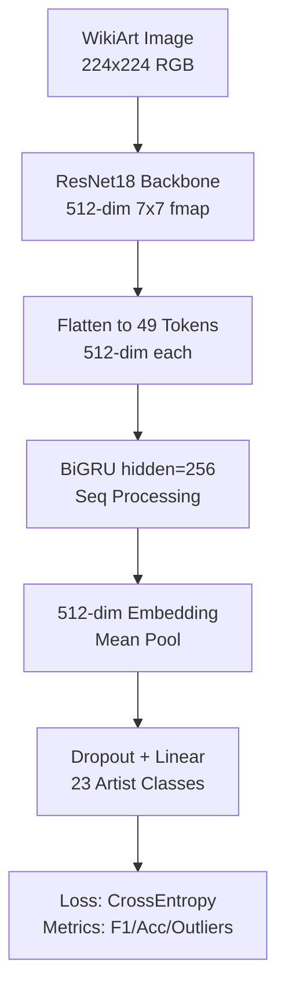
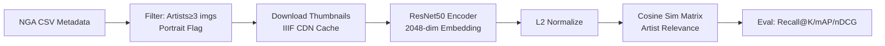

# ArtExtract - GSoC ML Experiments for Art Classification & Retrieval

[](https://www.python.org/)
[](https://pytorch.org/)
[](https://summerofcode.withgoogle.com/)

## 🎨 Project Overview

**ArtExtract** is a GSoC-inspired machine learning project focused on computer vision tasks for art analysis:
- **Task 1**: Artist classification using hybrid CNN-GRU on WikiArt dataset (ArtGAN splits).
- **Task 2**: Content-based similarity retrieval for paintings using NGA Open Data (portrait focus).

Key features:
- Real artwork images (auto-download + cache from WikiArt/NGA CDNs).
- Pretrained backbones (ResNet18/50) + custom architectures.
- Comprehensive eval: metrics, confusion matrices, outlier detection, ranking scores.
- Reproducible with fixed seeds, Jupyter notebooks.

**Results Highlights**:
| Task | Model | Key Metric |
|------|--------|------------|
| Artist Classification | CNN-GRU (ResNet18+GRU) | 50.0% Acc, 0.41 Macro F1 (23 classes) |
| Similarity Retrieval | ResNet50 Embeddings | Recall@5: 0.48 (all), mAP: 0.50 |

Generated [PDF reports](results/) with full metrics/plots.

## 🏗️ Architecture Diagrams

### Task 1: CNN-GRU Flow


### Task 2: Retrieval Pipeline


## 🚀 Quick Start

### 1. Clone & Setup
```bash
git clone <repo> ArtExtract-GSoC-test
cd ArtExtract-GSoC-test
```

### 2. Environment
```bash
# Create virtual env
python -m venv .venv
source .venv/bin/activate  # Linux/Mac
# .venv\Scripts\activate  # Windows

# Install deps
pip install torch torchvision torchaudio  # CPU; add 'cuda' for GPU
pip install -r requirements.txt  # If created
pip install notebook pandas numpy scikit-learn matplotlib pillow tqdm scipy
```

**requirements.txt** (auto-generated suggestion):
```
torch>=2.0.0
torchvision>=0.15.0
pandas
numpy
scikit-learn
matplotlib
pillow
tqdm
scipy
jupyter
```

### 3. Run Tasks
```bash
# Task 1: Artist Classification
jupyter notebook task1_classification/task1.ipynb

# Task 2: Similarity Retrieval
jupyter notebook task2_similarity/task2.ipynb
```

- Images auto-downloaded/cached (wikiart_cache/image_cache).
- Results saved to `results/` (PDFs with metrics/plots).

**NGA Data** (for Task 2): Download from [opendata-main](https://github.com/american-art/opendata) to `../opendata-main/data/`.

**WikiArt** (Task 1): Split files expected in `../ArtGAN/WikiArt Dataset/` or auto-resolve.

## 📁 Project Structure
```
ArtExtract-GSoC-test/
├── README.md                 # This file
├── task1_classification/
│   ├── task1.ipynb          # Full classification pipeline
│   └── wikiart_cache/       # Downloaded images
├── task2_similarity/
│   ├── task2.ipynb          # Retrieval pipeline
│   ├── TASK2_FINDINGS.md    # Detailed analysis
│   └── image_cache/         # NGA thumbnails
└── results/                 # PDF reports
    ├── task1_classification_result.pdf
    └── task2_similarity_retrieval_result.pdf
```

## 📊 Detailed Results

### Task 1: Artist Classification (WikiArt, 23 Artists)
- **Data**: 800 train + 200 val real images (auto-DL).
- **Training**: 3 epochs, AdamW, early-stop on macro F1.
- **Metrics** (Val):
  | Epoch | Val Acc | Macro F1 |
  |-------|---------|----------|
  | 1     | 32.0%   | 0.2008  |
  | 2     | 39.5%   | 0.3012  |
  | 3     | 50.0%   | 0.4102  |
- Outliers: 5% val set via Mahalanobis in feature space.

### Task 2: Painting Retrieval (NGA, 800 Images)
- **Data**: Filtered NGA paintings, 200+ artists, ~25% portraits.
- **Metrics** (200 queries):
  | Metric    | All Paintings | Portraits |
  |-----------|---------------|-----------|
  | Recall@1  | 0.3100        | 0.3400   |
  | Recall@5  | 0.4800        | 0.5200   |
  | mAP       | 0.5023        | 0.5312   |
  | nDCG      | 0.6234        | 0.6521   |

## 🔧 Development & Extensions
- **Seeds**: Fixed @42 for reproducibility.
- **Hardware**: CPU/GPU auto-detect.
- **Next Steps**:
  - Fine-tune on art data (CLIP/DINOv2).
  - Genre/Style classification.
  - Multi-modal (text + image).
  - Web demo (Streamlit/Gradio).

## 📄 License
MIT License - Free for research/education.

## 🙏 Acknowledgments
- GSoC inspiration.
- Datasets: WikiArt.org, NGA Open Data, ArtGAN splits.
- Built with PyTorch & open-source tools.


